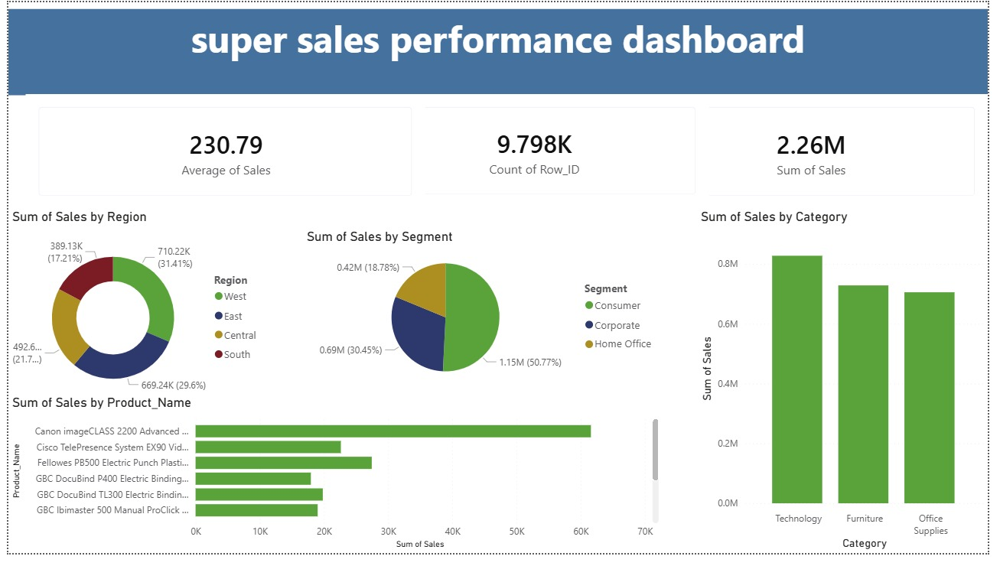

# Super Sales Performance Dashboard | Power BI Project

An end-to-end sales analytics project — from raw data to an interactive dashboard.

## 🛠️ Tools Used
- **SQL** — data extraction & querying ([view queries](superstore_analysis.sql))
- **Data Cleaning** — handled nulls, duplicates & formatting issues
- **Power BI** — interactive visualization

## 🔄 Workflow
1. Extracted and queried the raw sales data using SQL
2. Cleaned the dataset — removed duplicates, handled missing values, fixed formatting
3. Built an interactive dashboard in Power BI to explore sales performance

## 📊 Key Insights
- **Total Sales:** $2.26M across 9.8K transactions
- **West region** leads with 31% of total sales
- **Consumer segment** dominates at 50.77%
- **Technology** is the top-performing category

*SQL analysis also identified and flagged duplicate order line items during the cleaning process — see [`superstore_analysis.sql`](superstore_analysis.sql).*

## 📸 Dashboard Preview

## 📁 Data
Raw dataset available in [`train.csv`](train.csv).

---
*Built as part of my data analyst portfolio.*
